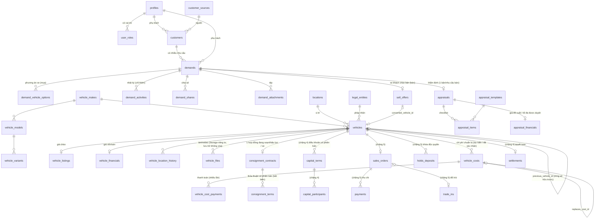

# Kiến trúc

## Tổng thể

```
Trình duyệt (máy tính / điện thoại)
   │  HTML render phía máy chủ + Server Actions (không có API công khai riêng)
Next.js trên Vercel
   │  middleware: xác minh JWT bằng getClaims(), chưa đăng nhập → /dang-nhap
   │  Server Components / Server Actions dùng client Supabase THEO PHIÊN người dùng
   │  (khóa bí mật chỉ dùng cho mời nhân viên, src/lib/supabase/admin.ts)
Supabase
   ├─ Postgres: bảng + RLS + trigger kiểm tra nghiệp vụ + RPC (security invoker, trừ vài hàm định nghĩa hẹp)
   ├─ Auth: email/mật khẩu, tài khoản do admin mời
   └─ Storage: bucket riêng tư demand-files, quyền theo thư mục <demand_id>/
```

Nguyên tắc: **database là nơi thực thi quy tắc cuối cùng.** Giao diện kiểm tra trước để báo lỗi thân thiện, nhưng mọi bất biến quan trọng
(việc tiếp theo bắt buộc, chuyển trạng thái, đóng phải có lý do, chống trùng khi gửi lại, chống ghi đè đồng thời, phân quyền) đều có ở database
và được test trực tiếp bằng SQL dưới vai trò `authenticated` — tương đương gọi Data API bỏ qua giao diện.

## Ranh giới dữ liệu

| Lớp | Bảng | Ai đọc |
|---|---|---|
| Thông tin xe | `vehicles` | nhân viên theo vai trò (sales: xe đang bán/giữ/cọc) |
| Giá chào | `vehicle_listings` | sales, quản lý, kế toán |
| Giá vốn, giá sàn | `vehicle_financials` | quản lý, kế toán, admin |
| Liên hệ khách | `customers` | người phụ trách / tạo / có nhu cầu được giao hoặc chia sẻ; quản lý |
| Tiêu chí ghép | `match_pool_*()` | sales — chỉ tiêu chí xe + người phụ trách, **không** SĐT/địa chỉ/biển số/VIN |

RLS lọc **hàng**, không lọc **cột** → dữ liệu nhạy cảm tách bảng thay vì dựa vào việc không select cột.

## Mô hình dữ liệu (ERD)

Chú thích: các bảng đánh dấu *(chặng N)* chưa tồn tại, chỉ là thiết kế định hướng để không phá vỡ cấu trúc hiện có.



Bảng hệ thống: `app_settings` (cấu hình vận hành, ví dụ số ngày coi là "lâu chưa cập nhật"), `audit_logs` (chỉ ghi bằng trigger),
`saved_filters` (bộ lọc riêng từng người).

## Quyết định kỹ thuật chính

- **Một doanh nghiệp, không đa tenant** (không bảng organizations). Pháp nhân (`legal_entities`) và địa điểm (`locations`) là danh mục.
- **Trạng thái xe tách nhiều chiều** (mới/cũ, sở hữu/ký gửi, nguồn, chuẩn bị, bán hàng, giấy tờ) — không gộp một cột "status".
- **Nhu cầu:** tiêu chí mua nằm trên `demands`; nhiều phương án xe ở `demand_vehicle_options`; xe khách chào bán ở `sell_offers`
  là *thông tin khách cung cấp*, không phải xe trong kho. Khi thu mua (chặng 3) sẽ sinh `vehicles` và ghi `converted_vehicle_id`.
- **Chống ghi trùng khi gửi lại:** mọi thao tác tạo quan trọng mang `client_request_id` duy nhất do form giữ qua các lần thử lại.
- **Chống ghi đè đồng thời:** cột `version` tăng bởi trigger; cập nhật kèm `version` cũ, lệch thì từ chối (mã lỗi 40001).
- **Nhật ký liên hệ chỉ thêm:** thu hồi quyền UPDATE/DELETE; nhật ký hệ thống (đổi người phụ trách) ghi qua hàm định nghĩa hẹp.
- **Danh mục hãng/model/phiên bản:** nhân viên được thêm mới khi nhập nhanh; chống trùng bằng khóa chuẩn hóa không dấu, không phân biệt hoa thường.
- **Ghép nhu cầu bằng quy tắc rõ ràng** (TypeScript thuần, `src/lib/matching.ts`), không AI; dữ liệu nguồn lấy qua RPC để không lộ liên hệ khách.
- **Menu và quyền vào trang** lấy từ một registry duy nhất (`src/lib/modules.ts`) — tránh lỗi menu hard-code lệch phân quyền từng gặp ở CRM cũ.
- **Không có API REST riêng:** Server Actions + RPC. Nếu sau này cần API cho bên thứ ba sẽ thiết kế riêng.

## Giới hạn hiện tại đã biết

- Khách chỉ có một số điện thoại; chưa có màn hình gộp khách trùng (chỉ cảnh báo khi nhập).
- Chưa có giao diện quản lý danh mục (hãng/model/màu/nguồn khách) và cấu hình `app_settings` — sửa qua SQL.
- Kho xe đã có nhập/sửa/lọc và nhập kho từ nhu cầu bán; thẩm định có checklist + duyệt mua đã có (lát 2); chi phí chuẩn bị xe đã có (lát 3); hợp đồng ký gửi đã có (lát 4); ảnh/video gắn với xe đã có (tải thẳng lên Storage bằng URL ký); quyết toán ký gửi là phần còn lại.
- Thông báo nhắc việc chỉ hiển thị trong app (Việc hôm nay, đèn báo); chưa gửi Zalo/email/push.
